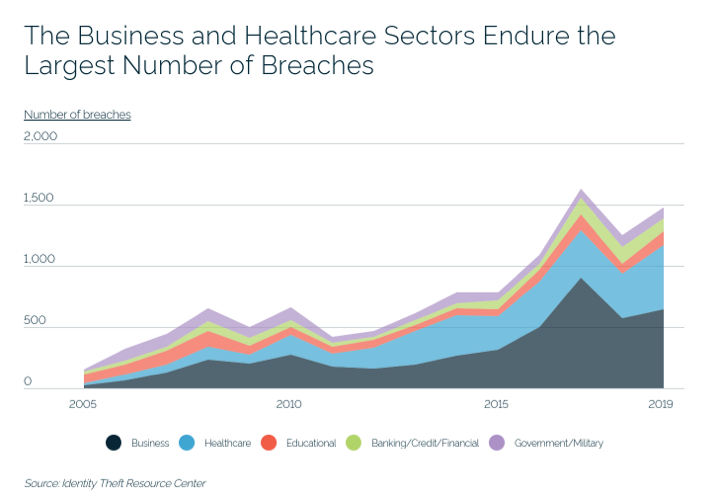
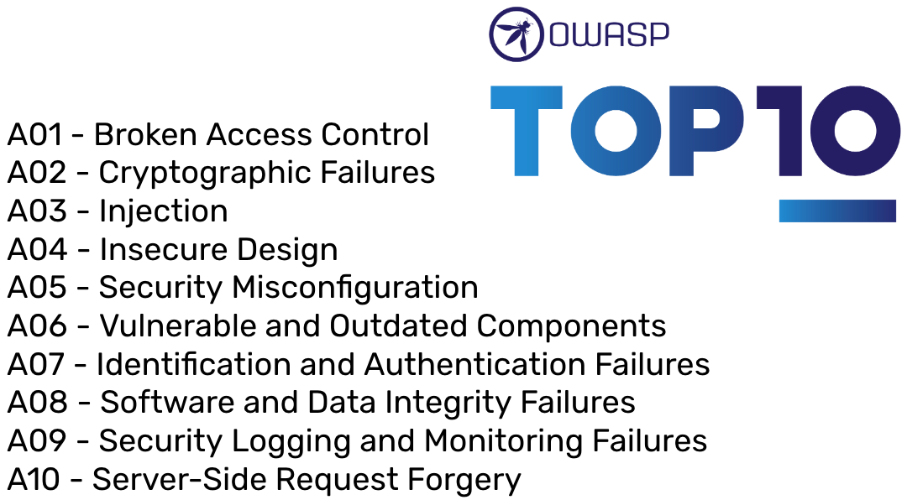

# OWASP and Web Security

It seems that every day, we see another story of how a company or a government's records have been hacked resulting in the release of sensitive personal information. **[Explore this link to see some of the top data breeches of all time and the data that was exposed](https://www.informationisbeautiful.net/visualizations/worlds-biggest-data-breaches-hacks/)**. Additionally, data breeches have been increasing with each year and have been particularly focussed on targeting businesses and healthcare.

If you're a developer, it can feel overwhelming to know where to focus. Fortunately, we have a trusted organization, the Open Web Application Security Project ([OWASP](https://owasp.org/)), that narrows it down for us. Through use of the [OWASP Top Ten](https://owasp.org/www-project-top-ten/), we can begin to narrow down and focus on the most common security vulnerabilities that developers face.

### What We Will Learn:
- What is OWASP?
- OWASP Top 10
- Why It's Important to Us

>[OWASP Video](https://www.loom.com/share/29e1051f13de4caaaaaa03dbc1650549)

## OWASP Top 10

The [OWASP Top 10](https://owasp.org/www-project-top-ten/) is a standard awareness document for developers and web application security. It represents a broad consensus about the most critical security risks to web applications. Using the OWASP Top 10 is perhaps the most effective first step towards ensuring we are building safe and secure web applications.

The OWASP Top 10 as of 2021 (they do the survey usually every 5 years) can be seen in the graphic below.

## checkoutTheDocs 🔍
- [OWASP](https://owasp.org/)
- **OWASP**: [The OWASP Top 10](https://owasp.org/www-project-top-ten/)

## Knowledge Check ✅

1. What is OWASP
    - **Open Web Application Security Project**
    - Other Web Apps Stink Poorly
    - Overt Web Apps Security Plan
    - Overambiguation With Algorithmic Solving of Problems

2. Why should developers care about Web Security? (select all that apply)
    - **Big companies get breached every day.  My app could be next.**
    - **Hackers are always getting smarter and more sophisticated at their techniques.**
    - **Developers, as the builders of these systems, have first-line responsibility to secure our applications.**