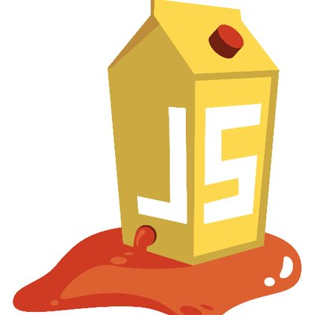

# OWASP Juice Shop 🧃

Have you ever wondered during our various modules: when are we going to learn to hack? ⭐️ **Over the next 10 weeks, we will be using the OWASP Juice Shop to perform and learn about many of the security risks in modern web applications. Additionally, we will dig deeper into learning how to protect our own code against these vulnerabilities!**

[OWASP Juice Shop](https://owasp.org/www-project-juice-shop/) is probably the most modern and sophisticated ***insecure*** web application! This is an app that is designed to be hacked in order to learn all about security vulnerabilities in our code. Juice Shop encompasses vulnerabilities from the entire [OWASP Top Ten](https://owasp.org/www-project-top-ten/) along with many other security flaws found in real-world applications!

### What We Will Learn
- What is the OWASP Juice Shop
- How we will be using OWASP Juice Shop

>[OWASP Juice Shop Video](https://www.loom.com/share/5983b821717e487f928b6c348299dce3)

## Juice Shop Architecture

The OWASP Juice Shop is a pure web application that utilizes many of the tools we have learned about throughout this course.
- **Front End**: Implemented in JavaScript and TypeScript (which is compiled into regular JavaScript). In the frontend the popular Angular framework is used to create a Single Page Application. 
- **Back End**: JavaScript is also used in the backend as the exclusive programming language. An Express application hosted in a Node.js server delivers the client-side code to the browser and necessary backend functionality to the client via a RESTful API. 
- **Database**: As an underlying database a light-weight SQLite is utilized. Sequelize and finale-rest are used as an abstraction layer from the database.

The following diagram shows the high-level communication paths between the client, server and data layers:

## #checkoutTheDocs 🔍
- **OWASP**: [Pwning OWASP Juice Shop](https://pwning.owasp-juice.shop/)
- **OWASP**: [Juice Shop Architecture](https://pwning.owasp-juice.shop/introduction/architecture.html)

## Knowledge Check ✅

1. What is OWASP Juice Shop?
    - An application where we can order juice and other merchandise.
    - **The most modern and sophisticated insecure web application.**
    - A secure web application that is very difficult to hack.
    - An application used to learn how to create JavaScript web applications.

2. What language is the Juice Shop written in?
    - C#
    - Java
    - Python
    - **JavaScript**