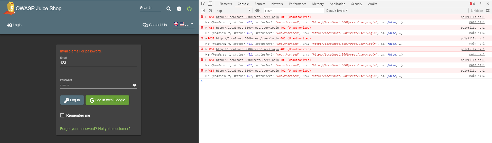
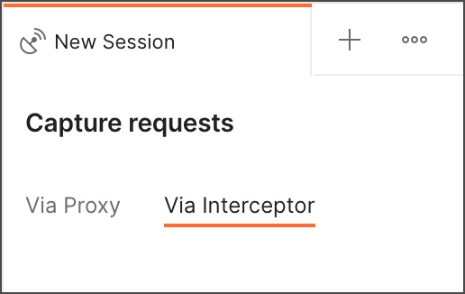
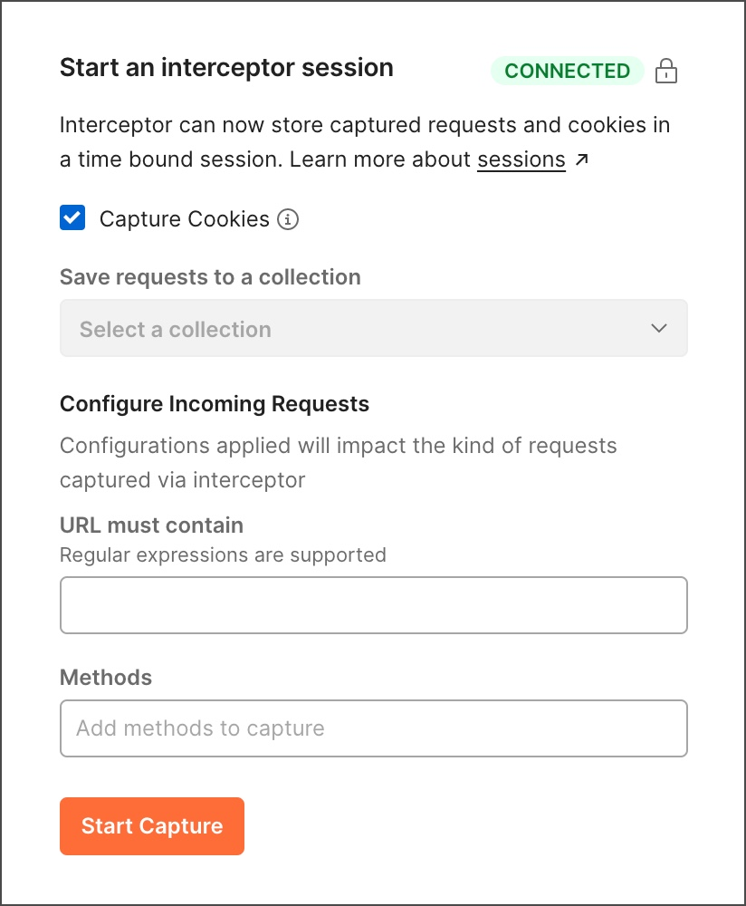

# Hacking Setup

In order to Hack the Juice Shop, we need the proper tools! 

Luckily, the majority of the tools we will use to hack are the tools we have used throughout this course. Below will cover the various setups you will need in order to successfully hack the Juice Shop!

## Browser Selection

You can use either Firefox or Chrome while hacking the OWASP Juice Shop. Both provide sufficient tools to solve all problems.

> Firefox allows you to capture and resend HTTP requests directly in the browser. If you opt to use Chrome, make sure to download Postman Interceptor in the sections below.

## Browser Dev Tools

When hacking a web application that relies heavily on JavaScript, ⭐️ **it is essential to your success to monitor the JavaScript Console permanently!** It might leak valuable information to you through error or debugging logs!

**Other useful features of browser DevTools are:**
- Their network overview as well as insight into the client-side JavaScript code
- Cookies and other local storage being used by the application.

## Setting Up Postman Interceptor (CHROME ONLY)

At various times we are going to want to read the HTTP requests being sent by the page and send our own responses. **We can use Postman to send HTTP requests, but we will need to use [Postman Interceptor](https://learning.postman.com/docs/sending-requests/capturing-request-data/interceptor/) to capture network requests from Juice Shop.**

1. Download Interceptor in the Chrome Web Store. If you already have the extension, ensure it's version v0.2.26 or later.
2. In Postman, select Capture icon Capture requests in the Postman footer.
3. On the Capture requests window, select the Via Interceptor tab.

4. Select Install Interceptor Bridge to download the Bridge, an independent executable that facilitates communication with the Interceptor.
5. Confirm Interceptor is ready to use by checking that the Connected status in the upper right is green. You can now capture requests from your browser and cookies from any domain to use in Postman.

## Using Postman Intercepter (CHROME ONLY)

1. Go to the Via Interceptor tab of the Capture requests window.
2. Select Capture Cookies if you want to capture cookies in addition to requests during the debug session. You can use these cookies in your Postman requests.
3. By default, requests will be saved in a debug session in the History tab in the sidebar. To also save requests to a collection, select a collection from the list under Save requests to a collection.
4. Under URL must contain, **paste your Juice Shop URL into the area (http://localhost:3000/)**
5. Under Methods, select one or more methods to capture only those methods. Typically, it's best to capture all CRUD methods (GET, POST, PUT, and DELETE)
6. Select Start Capture.

## #checkoutTheDocs

- **Pwning OWASP Juice Shop**: [Hacking Exercise Rules](https://pwning.owasp-juice.shop/part1/rules.html)
- **Postman**: [Postman Interceptor](https://learning.postman.com/docs/sending-requests/capturing-request-data/interceptor/)

## Knowledge Check ✅

1. Verify you have the following setup:
    - **I am using either Firefox or Chrome as my browser**
    - **I will have Dev Tools open the entire time I am hacking the Juice Shop**
    - **If I am using Chrome, I have downloaded Postman Interceptor**
    - **If I am using Chrome, I have setup Postman Interceptor to intercept all GET, POST, PUT, and DELETE requests from http://localhost:3000/.**