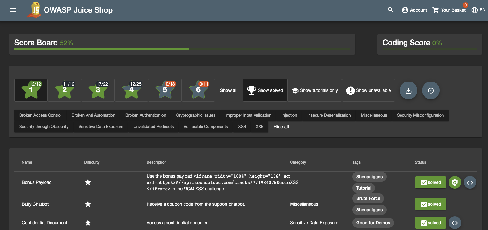

# Find the Score Board

You've now explored all parts of the page...right? ⭐️ **The developers have carefully hidden a scoreboard that you need to find in order to know and keep track of all your challenges!**

## Tips for Finding the Score Board

Why was the Score Board not visited during the "happy path" tour? Because there seemed to be no link anywhere in the application that would lead you there! You know that it must exist, which leaves a few possible explanations:
1. You missed the link during the initial mapping of the application (not likely).
2. There is a URL that leads to the Score Board but it is not hyperlinked to.
3. Knowing it exists, you can simply guess what URL the Score Board might have.
4. Alternatively, you can try to find a reference or clue within the parts of the application that are not usually visible in the browser, **but are visible using the Developer Tools.**

**Still Stuck? Use this video to help solve your first challenge!**

>[Finding the Hidden Scoreboard Video](https://www.loom.com/share/2890794d821a4960b5f7c888f1b7960b)

5. What is the URL for the carefully hidden score board?

## #checkoutTheDocs 🔍
**Pwning OWASP Juice Shop**: [Finding the Score Board](https://pwning.owasp-juice.shop/part2/score-board.html)