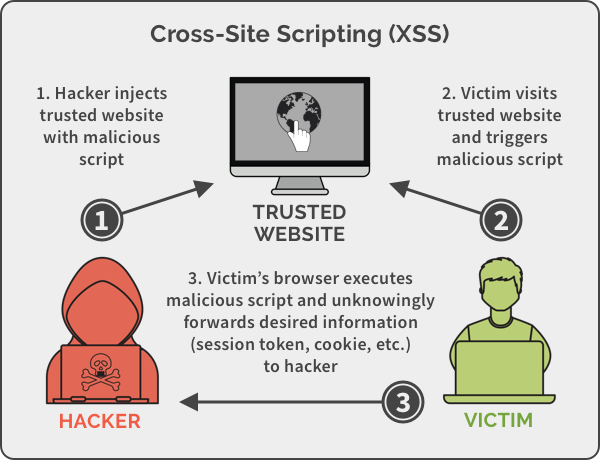

# Injection with Cross Site Scripting (XSS)

Modern websites are constantly accepting data. Think about something as simple as a search bar on the [Google homepage](https://www.google.com/). We type ***data*** into this search bar and the browser returns information to us.

Search bars and other areas for user input are inherently insecure because there is nothing stopping the user from entering a command that could run malicious code on our otherwise safe web browser. ⭐️ **Without proper security protections, areas for user input can be utilized to send a browser side script that can be triggered by unsuspecting users.**

**Cross Site Scripting (XSS)** is a type of injection in which malicious scripts are injected into otherwise benign and trusted websites. XSS attacks occur when an attacker uses a web application to send malicious code, generally in the form of a browser side script, to a different end user.

### What We Will Learn
- What is Injection?
- How does it happen? 
- Cross Site Scripting (XSS)

>[Injection Video](https://www.loom.com/share/e4410502893f493dbf4b07c56b9083b9)

## XSS Injection

Cross Site Scripting (XSS) attacks typically are broken down into three distinct phases:
1. The hacker injects a trusted website with a malicious script (something like `<iframe src="javascript:alert("xss")/>`).
2. The victim visits an otherwise trusted website and triggers the malicious script that has been injected.
3. The victims browser runs the malicious script and unknowingly forwards desired information (session tokens, cookies, etc.) to the hacker that injected the script.

## #checkoutTheDocs 🔍
- **OWASP**: [Injection](https://owasp.org/Top10/A03_2021-Injection/)

## Knowledge Check ✅

1. **Fill In The Blank**: Injection happens when a hacker inputs some malicious code that ends up being interpreted as an [blank] for the web app to follow.
Blank 1

2. What is one potential consequence of an XSS attack?
    - **The victim’s browser executes a malicious script that forwards sensitive data to the hacker.**
    - A user can no longer visit a website
    - The server is overloaded with requests
    - The database runs a command injected by a hacker