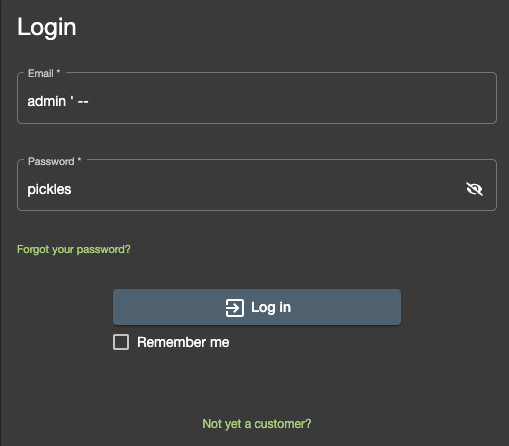
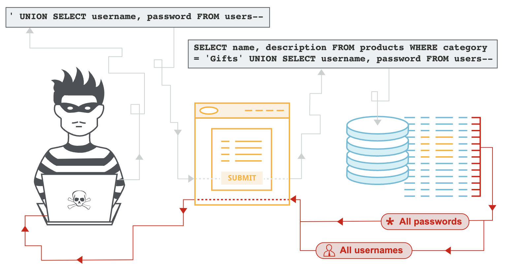

# SQL Injection

Suppose you were a malicious user and wanted to access another users page without having to use their password. You might first attempt something like this:



This is an example of <span style = "color: #FE4646">**SQL Injection**</span>. ⭐️ <span style = "color: #21B581">**SQL Injection is a when an attacker is able to interfere with queries made to a database because the site has not incorporated proper protections against malicious user input.**</span> SQL injection can result in sensitive data like username and passwords being exposed if proper input validations have not been incorporated in the application.



### What We Will Learn
- Injection Review
- SQL Injection
- How to Protect Against SQL Injection

>[SQL Injection Video](https://www.loom.com/share/2f899d4e71c04cbba5a258bedabc92c7)

## Protecting Against SQL Injection

Most instances of SQL injection can be prevented by using parameterized queries (also known as prepared statements) instead of string concatenation within the query. A <span style = "color: #FE4646">**parameterized query**</span> is a query in which placeholders are used for parameters and the parameter values are supplied at execution time.

```javascript
app.post('/register', async (req, res, next) => {
    const { username, password } = req.body;
    const user = await db.query(`
        INSERT INTO users (username, password)
        VALUES (:username, :password)
        RETURNING *;
        `,
        {
        replacements: { username, password }
        }
    );
  res.send(user);
});
```

When receiving input of a username (or other data), we should not directly interpolate it into the SQL query. Instead, we should use bind variables via the library we are using to connect to our database. This “sanitizes” the SQL and disallows the injection from happening. **NOTE**: Object Relational Mappers (like Sequelize) sanitize SQL inputs for us!

## #checkoutTheDocs 🔍
- **OWASP**: [Injection](https://owasp.org/Top10/A03_2021-Injection/)
- **W3Schools**: [SQL Injection](https://www.w3schools.com/sql/sql_injection.asp)

## Knowledge Checks ✅

1. When are applications more vulnerable to SQL injection?
    - When the user attempts a `POST` request
    - **When the application asks for user input**
    - When the user navigates to defined routes
    - Anytime the application runs a SQL query

2. If a SQL input is not sanitized, what can be injected into the SQL statement?
    - Only `SELECT` statements
    - `SELECT` and `UPDATE` statements
    - Only `DELETE` statements
    - **Virtually any command the hacker writes**

3. What is the best way to protect against ***most*** SQL injection attacks
    - Always use string concatenation for user input 
    - Never use a SQL database in your application
    - **Parameterized queries**