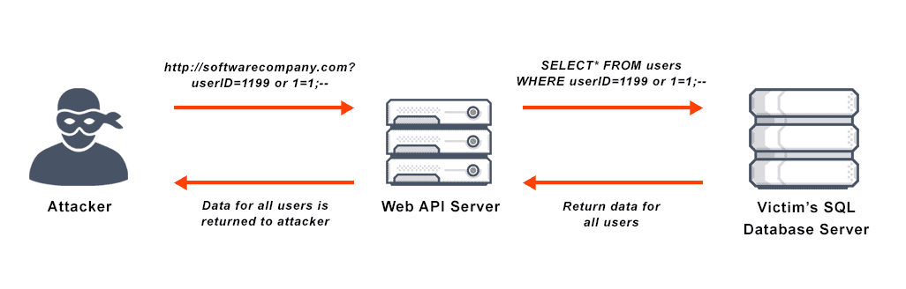

# Common SQL Injection Methods

We now have a broad understanding of what SQL Injection is and how to prevent these types of attacks, but how do we perform a SQL Injection attack? Recall, **injection attacks are most often performed at parts of the application that accept user input**. Therefore, we can run our SQL injection attacks in many of the same places the XSS attacks can be performed through the use of SQL statements like `--,` `1 = 1`, and `UNION`.

### What We Will Learn
- SQL Injection with `--`
- SQL Injection with `1 = 1`
- `UNION`

>[Common SQL Injection Methods](https://www.loom.com/share/de95c8573c024f9cb170607843706a34)

## SQL Injection Methods Summary

Below is a list of common SQL injection methods. These should be thought of as a ***starting point***. There are **MANY** ways to perform a SQL injection, but the methods below are some of the most commonly used.

| SQL Method | Summary |
| ---------- | ------- |
| `--` | The double dash indicates a comment and can result in commenting out essential query protections. |
| `1 = 1` | Using a boolean statement that is always true can lead to access to otherwise inaccessible data. |
| `UNION` | When data is returned, an attacker can also leverage `UNION` to access other data tables in the database |

## #checkoutTheDocs 🔍
- **OWASP**: [Injection](https://owasp.org/Top10/A03_2021-Injection/)
- **W3Schools**: [SQL Injection](https://www.w3schools.com/sql/sql_injection.asp)

## Knowledge Checks ✅

1. What does `--` do when incorporated in a SQL injection attack?
    - It deletes one item from the database
    - It returns all users in a database.
    - It joins two values together.
    - **It creates a SQL comment that comments out any value after this value**

2. Why would a hacker use `1 = 1` as part of a SQL injection attack?
    - Used when you need an always true statement that will allow for access to otherwise inaccessible data.
    - Used when you need to check for equality of two items.
    - Used when you want to join databases together
    - It creates a SQL comment that comments out any value after this value