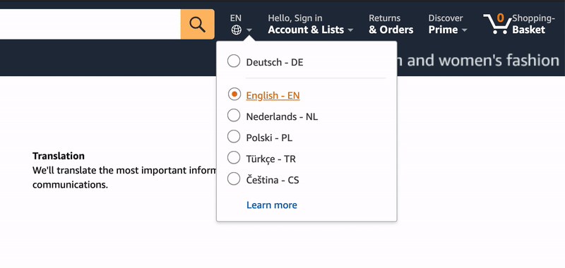
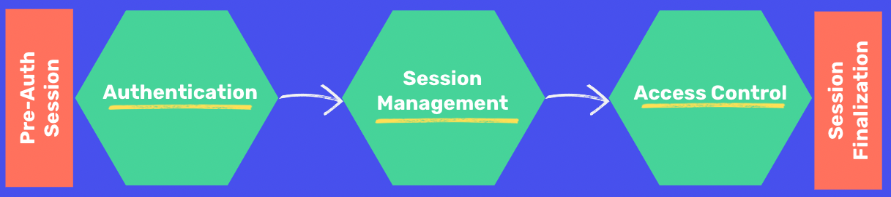
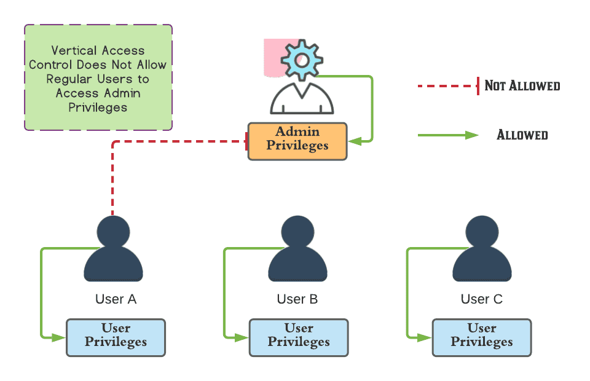
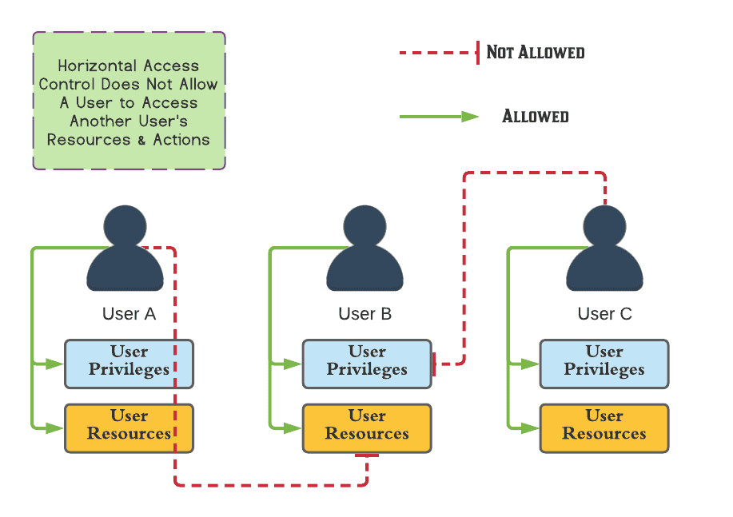
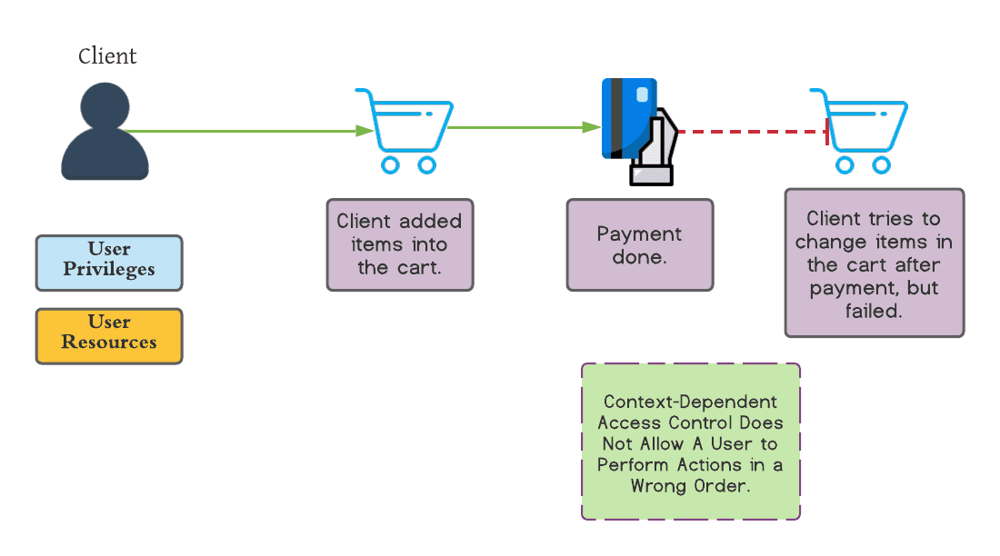

# Types of Access Control

Suppose you were navigating on Amazon's website and didn't speak English, how would you navigate all of their products? Luckily Amazon allows users to toggle the language of the page.

Many modern websites incorporate this capability, but HTTP is a stateless protocol where each request and response pair is independent of other web interactions. This means that each HTTP request won't have memory of the previous request, so things like language preference for a particular user can be quickly lost. Thus, ⭐️ **access control requires that our applications know who the users are that are currently using our application.**

⭐️ **In the context of web applications, access control is dependent on authentication and session management:**
- **Authentication**: Identifies the user and confirms that they are who they say they are. For example, a site can use OAuth 2.0 to have users login with their Google accounts.
- **Session management**: Identifies which subsequent HTTP requests are being made by that same user. 
- **Access control**: Determines whether the user is allowed to carry out the action that they are attempting to perform.

### What We Will Learn

- Authentication, session management, and access control
- Vertical access controls
- Horizontal access controls
- Context-dependent access controls

>[Types of Access Controls](https://www.loom.com/share/679f1e6d92f84ea1843c6f5945ba6127)

## Types of Access Control

From a user perspective, access controls can be divided into the following categories:
- Vertical access controls
- Horizontal access controls 
- Context-dependent access controls

**Vertical access controls** are mechanisms that restrict functionality that are not available to other types of users. For example, there might be a certain user that has access to admin privileges that allow the user to access sensitive user information. The typical user would not be given access to these pages/tools.

**Horizontal access controls** are mechanisms that restrict access to resources to the users who are specifically allowed to access those resources. For example, a user on a banking application can access their transactions and account balances, but cannot view other users accounts or transactions. 

**Context-dependent access controls** restrict access to functionality and resources based upon the state of the application or the user’s interaction with it. These controls prevent user from performing actions in the wrong order. For example, a user cannot change an item from their cart after payment.

## #checkoutTheDocs 🔍
- **OWASP**: [Session Management Cheat Sheet](https://cheatsheetseries.owasp.org/cheatsheets/Session_Management_Cheat_Sheet.html)
- [A Comprehensive Guide to Access Controls](https://www.prplbx.com/resources/blog/broken-access-control/#1-introduction)

## Knowledge Check ✅

1. Which is an example of vertical access control?
    - On a shopping website, users cannot view another users basket.
    - A user cannot view a form response page without submitting a form.
    - **Certain users have a permission of "editor" that allows them to access content on the web page.**

2. Which is an example of horizontal access control?
    - **On a shopping website, users cannot view another users basket.**
    - A user cannot view a form response page without submitting a form.
    - Certain users have a permission of "editor" that allows them to access content on the web page.

3. Which is an example of context-dependent access control?
    - On a shopping website, users cannot view another users basket.
    - **A user cannot view a form response page without submitting a form.**
    - Certain users have a permission of "editor" that allows them to access content on the web page.