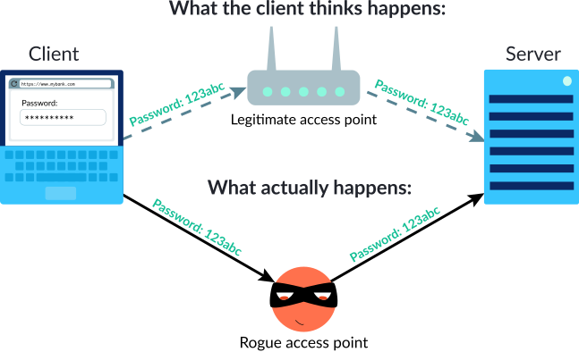
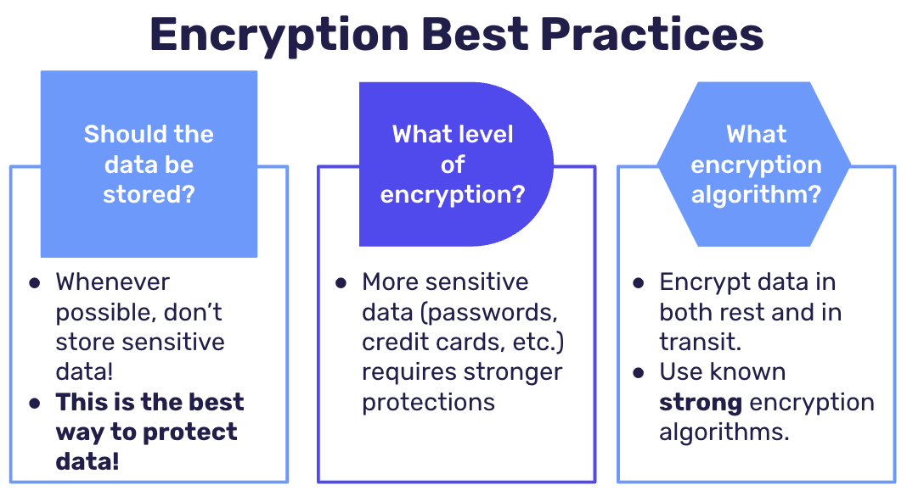

# Cryptographic Failures

In our digital and our physical lives alike, we want to protect that which we value the most. 

We value our young children, so we make sure that when they're riding in the car, they sit in protective car seats. 

We value our online banking password, and we expect that the web app that allows us to bank online is encrypting our password.

When developing applications, this is no different: ⭐️ <span style = "color: #21B581">**We need to make sure to protect the data that is the most sensitive/valuable. Protecting it comes in the form of <span style = "color: #FE3636">encryption</span> which is a method by which information is converted into secret code that hides the information's true meaning.**</span>

The Internet was built upon the principles of open protocols in order to promote decentralization and scalability. However, this introduces some very LARGE security concerns. Protocols like HTTP transmit information in plain text that are readable by anyone that has access to the traffic over a router. Thus, ⭐️ <span style = "color: #21B581">**someone with access to the network traffic (like what happens with [rogue access points](https://en.wikipedia.org/wiki/Rogue_access_point)), could potentially read all the information that is being transmitted from our browser to a server.**</span>



### What We Will Learn
- What are Cryptographic Failures?
- When to encrypt?
- What level of encryption?
- Don’t store if you don’t have to
- How to encrypt?
- Practical Example

>[Cryptographic Failures](https://www.loom.com/embed/097b0049d0d64c54affaab052c232fd7)

## Try It Out! 💻

> You will need Postman to complete this task. All code should be written in `server.js`.

1. Run the code that is currently written and open the `/users` route. All of the passwords are currently being stored in plain text! This is a huge cryptographic failure that we can fix using bcrypt. Start by importing bcrypt at the top of the `server.js` file.
    <details>

    ```javascript
    const bcrypt = require('bcrypt');
    ```

    </details>
2. In the `/register` route:
    - Destructure the name and password into variables from the request body.
    - Hash the password using a salt value between 5 and 10.
    - Create the new user in the User database.
    <details>

    ```javascript
    app.post("/register", async(req, res, next) =>{
        const { name, password } = req.body;
        const hashed = await bcrypt.hash(password, 10)
        const user = await User.create({
            name,
            password: hashed
        })
        res.send("successfully created user " + user.name)
    })
    ```

    </details>

3. Send a `POST` request using Postman to the `/register` route. Verify that the user has been added by navigating to the /users route.

## Encryption Best Practices

When deciding whether to encrypt data, there are three questions you should consider:
- Should the data be stored?
- What level of encryption does the data require?
- What encryption algorithm should I use?



## #checkoutTheDocs 🔍

- **OWASP**: [Cryptographic Failures](https://owasp.org/Top10/A02_2021-Cryptographic_Failures/)

## Knowledge Checks ✅

1. **Fill In The Blank**: Cryptographic failures happen when sensitive application [blank] is exposed on a weak or non-existent cryptographic algorithm

2. What is one of the first (and arguably easiest) ways to protect data?
    - Use a complex, strong algorithm.
    - **Don’t store the data at all**
    - Hash the data
    - Store it in the database

3 .Which of these algorithms are strong algorithms?
    - **AES**
    - MD5
    - Blowfish (bcrypt)