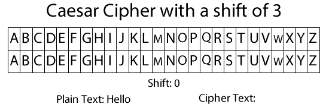

# Weak vs. Strong Encryption Algorithms
Humans have been encrypting messages for as long as we have wanted to keep information private. Back in the time of the Romans, Julius Caesar wanted to keep his military communication private, so he used a technique that shifted each letter by 13 positions. To decrypt, the recipient would need to shift each letter back 13 positions. This is commonly known today as ROT13 encryption.

Computers have made many aspects of our life quicker and more efficient. Unfortunately, ⭐️ **computers have also made decrypting messages much faster.** Therefore, old techniques like ROT13 that would take humans a long time to decode can be done nearly instantaneously by a computer. Computer scientists have had to continually invent new encryption algorithms that ensure that as computers get faster our data will continue to remain secure. ⭐️ **The encryption algorithms we use today may not be sufficient in the future.**

### What We Will Learn
- Encryption Overview
- Weak Encryption Algorithms
- Strong Encryption Algorithms

>[Strong vs. Weak Encryption Video](https://www.loom.com/share/c920184c3052457f91a553ce68bc8fbc)

## Examples of Strong and Weak Encryption Algorithms

Below is a summary of some ***current*** encryption algorithms that are considered strong and weak. As computers become more powerful, encryption algorithms that we currently consider strong may be weak in the future. As programmers, we need to stay abreast to current encryption best practices so that we continuously utilize only strong encryption algorithms.

| Strong Encryption Algorithms | Weak Encryption Algorithms |
| ---------------------------- | -------------------------- |
| AES | MD4/MD5 |
| RSA | SHA-1 |
| Blowfish | DES | 
| Twofish | ECB |

## #checkoutTheDocs 🔍
- **OWASP**: [Testing for Weak Encryption](https://owasp.org/www-project-web-security-testing-guide/latest/4-Web_Application_Security_Testing/09-Testing_for_Weak_Cryptography/04-Testing_for_Weak_Encryption)

## Knowledge Check ✅

1. Why do we need to encrypt information sent using the Internet?
    - Public decryption keys are known so are inherently insecure.
    - The Internet's decentralized structure requires encryption.
    - The Internet was designed with security in mind. All information is encrypted by default.
    - **Anyone with access to the traffic of information can read the information being sent.**

2. Which of these is an insecure encryption algorithm?
    - Blowfish
    - AES
    - **MD5**
    - RSA

3. **True or False**: The encryption algorithms we use today will continue to be the most secure algorithms we use the future.
    - True
    - **False**