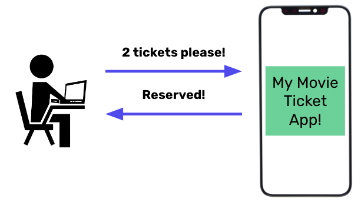
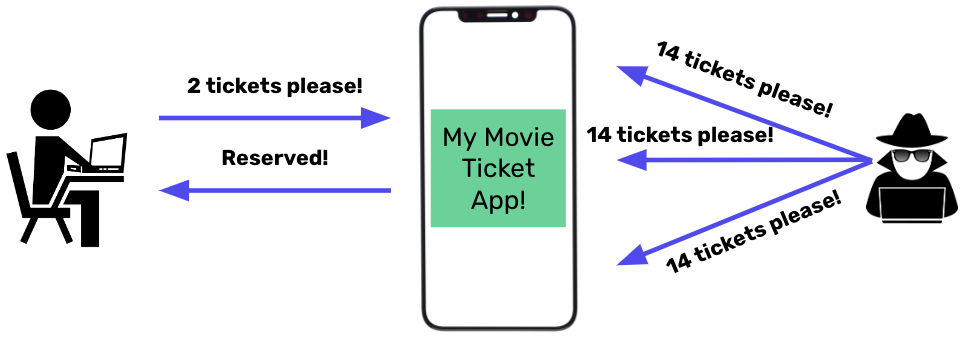

# Insecure Design

You have been hired by a local movie theater to design an application for them. They have given you the following guidelines for how the customer will interact with their site.
1. Users can reserve tickets using the application
2. If they request less than 15 tickets, they will pay when they get to the theater.

However, you quickly realize that there is a problem with this design. Suppose a malicious actor were to continuously request 14 tickets. You'd sell out the tickets without ever receiving payment for tickets!

The above is an example of number 4 on the OWASP Top 10: **Insecure Design**. The foundations of our web application are built in the design phase. An insecure design cannot be fixed by a perfect implementation as by definition, needed security controls were never created to defend against specific attacks. Therefore, ⭐️ **if we design without security in mind, our web app has the potential to be vulnerable to attack.**

### What We Will Learn 
- What is Insecure Design?
- Examples

>[Insecure Design Video](https://www.loom.com/share/95b012f9cb854fe9b0b765fa1dc92c97)

## #checkoutTheDocs 🔍
- **OWASP**: [Insecure Design](https://owasp.org/Top10/A04_2021-Insecure_Design/)

## Knowledge Check ✅

1. Should we expose all error messages to the user?
    - Yes! Without them, the user will not know how to resolve a problem.
    - If an error message is helpful to the user, we should always display it.
    - **No. Only show error messages that are (1) helpful and (2) do not expose sensitive information**

2. Should we use Questions and Answers as part of a credential recovery workflow?
    - Yes. Without them, users cannot verify they are who they say they are.
    - Questions and answers can be a good back-up authentication method.
    - **No. Using “questions and answers,” in a credential recovery workflow is prohibited by OWASP.**