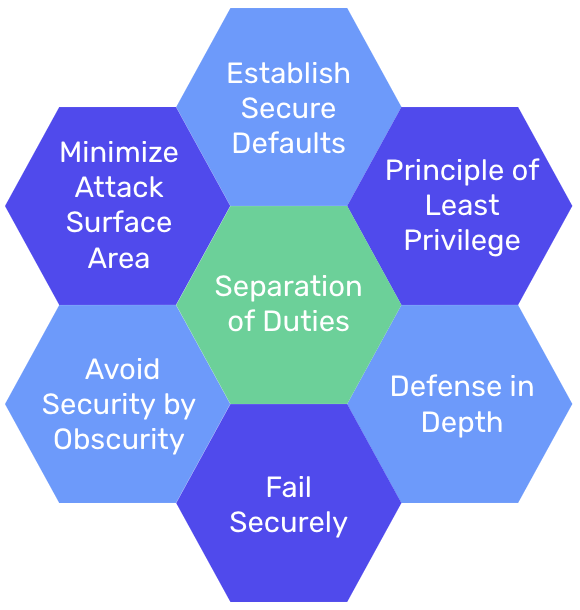

# Secure Design Best Practices

There are many steps developers should take to ensure that they are designing secure applications, but a few important guiding principles are shown in the diagram below.

### What We Will Learn
- Secure Design
- Secure Design Best Practices

>[Secure Design Best Practices](https://www.loom.com/share/75f890c450914e95963d10198b8e7f0d)

## Secure Design Summary

Below is a summary of seven secure design principles that developers should consider as they design applications. 
1. **Minimize Attack Surface Area**: Every time a programmer adds a feature to their application, they are increasing the risk of a security vulnerability. This principle encourages programmers to restrict the functions that users are allowed to access, to reduce potential vulnerabilities.
2. **Establish Secure Defaults**: Establishing safe defaults means there should be strong security rules for how user registrations are handled, how often passwords must be updated, how complex passwords should be, and so on.
3. **The Principle of Least Privilege**: A user should have the minimum set of privileges required to perform a specific task.
4. **The Principle of Defense in Depth**: Multiple security controls that approach risks in different ways are the best option for securing an application. Instead of having one security control for user access, you should have multiple layers of validation, additional security auditing tools, and logging tools.
5. **Fail Securely**: Application failure should not give the user additional privileges, and it should not show the user sensitive information like database queries or logs.
6. **Avoid Security by Obscurity**: There should be sufficient security controls in place to keep your application safe without hiding core functionality or source code. We should assume that anything hidden on a page can be found by a malicious actor. 
7. **Separation of Duties**: No one person has sole control over the lifespan of a transaction. For example, If a user has admin privileges, then they shouldn't be able to do things that the customer does and vice versa.

## #checkoutTheDocs 🔍

- **PatchStack**: [Security By Design Principles](https://patchstack.com/articles/security-design-principles-owasp/)

## Knowledge Check ✅

1. If someone is automatically granted administrator privileges upon signing up, which secure design principle are we not adhering to?
    - Separation of Duties
    - Principle of Defense in Depth
    - **Principle of Least Privilege**
    - Avoid Security by Obscurity
2. A user is able to find the path to access an admin dashboard on a site without requiring any other verifications. Which principle is this site not adhering to?
    - Separation of Duties
    - Fail Securely
    - Minimize Attack Surface Area
    - **Avoid Security by Obscurity**
3. A site is setup so that only customers are able to checkout and delete items from their basket and only admins are able to cancel orders. What secure design principle is this site adhering to?
    - Minimize Attack Surface Area
    - Separation of Duties
    - Principle of Defense in Depth
    - **Separation of Duties**