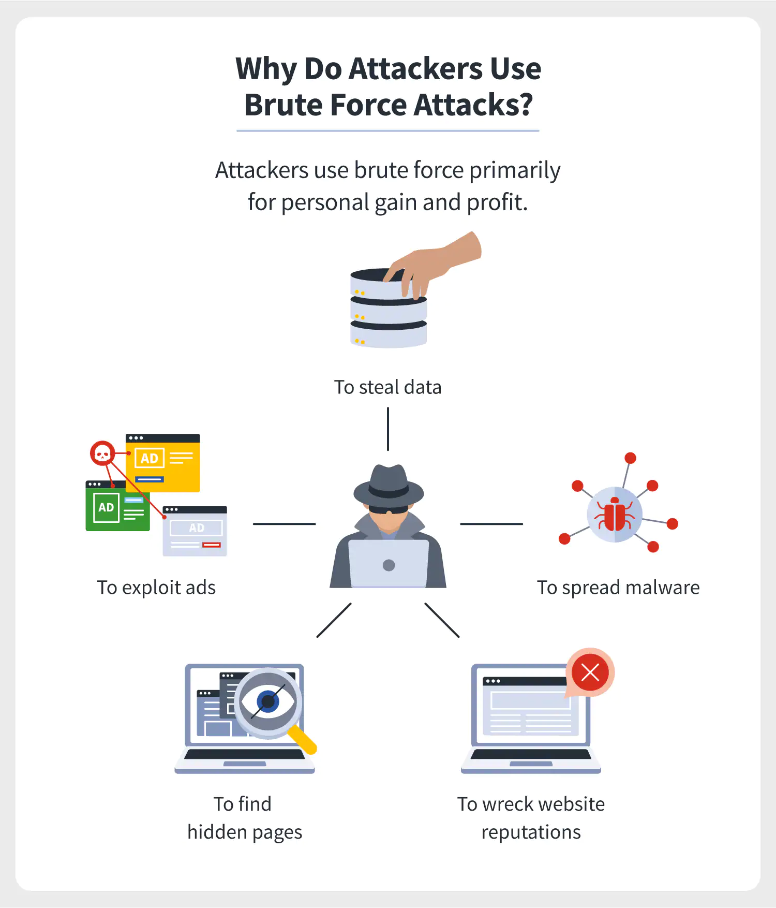
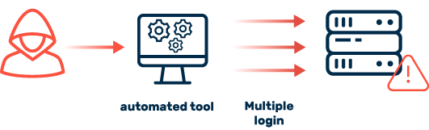

# Brute Force Attacks

Back in 2009, a company named RockYou was hacked. This wouldn't have been too much of a problem if they hadn't stored all of their passwords unencrypted in plain text for an attacker to see. They downloaded a list of all the passwords and made it publicly available. [Take a look at the database](https://www.kaggle.com/datasets/wjburns/common-password-list-rockyoutxt). Is your password on the list? 

This, and other lists similar to this, provide an excellent starting point for **Brute Force Attacks**. These attacks are ⭐️ **a way of guessing a password, or gaining access to something locked, simply by repetitive, trial and error-based guesswork.** Using a known password list like that provided by RockYou.txt, programmers can automate a system to perform many logins all at once in order to discover what a users password is.

### What We Will Learn
- What are Brute Force Attacks?
- How are Brute Force Attacks are Performed
- How to Prevent Attacks

>[Brute Force Attacks Video](https://www.loom.com/share/acbb46814da6427eb46ad6fefd336fdf)

## Preventing Brute Force Attacks

A Brute Force Attack utilizes automated tools to attempt many logins in order to attempt to discover a username and password.

As developers, there are designs that we can incorporate to discourage and prevent successful brute force attacks:

1. **REQUIRE Strong Passwords**
    - As users increase the length and complexity of their passwords, this ensures that automated tools will need to take much longer in order to successfully complete a brute force attack. 
2. **Limit Login Attempts**
    - Locking users out of accounts after a certain number of attempts can greatly decrease the likelihood of successful attacks
3. **Use CAPTCHA**
    - A type of challenge–response test used in computing to determine whether the user is human. Automated tools typically can't handle the complexity of different CAPTCHA questions for each login. 
4. **Use Two Factor Authentication**
    - Sending a one time password to something the user has (typically their phone) ensures that a Brute Force Attack cannot be successful without that device.
5. **Detect Using Brute Force Tools**
    - Tools like WFuzz, OWASP DirBuster, and scanners like Nessus can help identify probable probing by bad actors.

## #checkoutTheDocs 🔍
- **OWASP**: [Brute Force Attack](https://owasp.org/www-community/attacks/Brute_force_attack)

## Knowledge Check ✅

1. What is a Brute Force Attack?
    - An attack that is focussed on making a resource (like a website) unavailable for the purpose it was designed.
    - Sending malicious emails to a user with the hopes of obtaining sensitive information like their password.
    - **A way of guessing a password, or gaining access to something locked, simply by repetitive, trial and error-based guesswork**
    - A process of decrypting a password that has been encrypted using an otherwise secure encryption algorithm.

2. Select ALL of the options that are valid ways to help guard against Brute Force Attacks?
    - **Use CAPTCHA**
    - **Limit Login Attempts**
    - Allow passwords of any length
    - **Use Brute Force detection tools**

3. Why is 2 Factor Authentication (2FA) particularly strong is guarding against Brute Force Attacks?
    - 2FA prevents multiple login attempts
    - 2FA fixes issues with CAPTCHA.
    - 2FA ensures that the users password is strong.
    - **2FA requires the hacker to have access to both the users password and the users phone.**