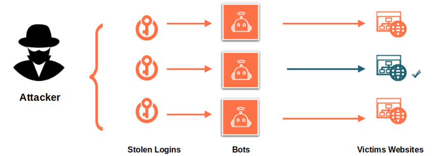
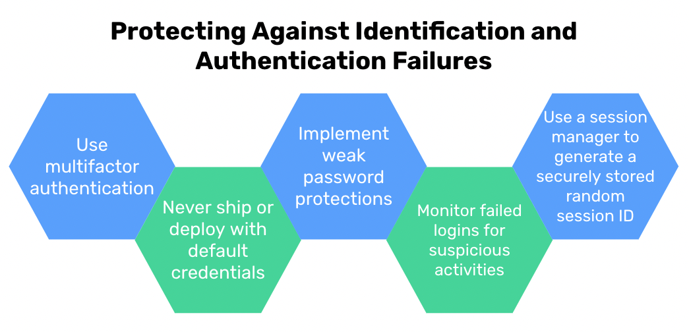

# Identification and Authentication Failures

Suppose someone goes to the bank and tries to take money out of your account. Suppose this person also has your account and pin number. If the bank doesn't ask for the individuals ID they could easily walk out with all the money that is stored in your account! Luckily banks verify an individual's identity before they can withdraw funds by asking for identification even when the person presents the necessary account information.

Applications that have proper security protocols also need to verify a users identity. ⭐️ <span style = "color: #21B581">**Applications need to confirm a user's identity, authenticate that the user is who they say they are, and implement session management in order to protect against authentication-related attacks.**</span> If an application does not “ask a user for identification” and confirm this identification is valid before sending back sensitive data.

### What We Will Learn
- What are Identification and Authentication Failures? 
- Examples
- Practical Implementation

>[Identification and Authentication Failures Video](https://www.loom.com/share/827f1a59fe064ba4b61e999023e581ca)

## Try It Out! 💻

**TASK**: Create a function called `validatePassword` that will verify the user has created a password that:
- Has least 8 characters long
    <details>

    ```javascript
    const isAtLeast8 = password.length >= 8;
    ```

    </details>

- Contains uppercase and lowercase letters
    <details>

    ```javascript
    const includesUpperCase = password.match(/[A-Z]/);
    const includesLowerCase = password.match(/[a-z]/);
    ```

    </details>

- Contains a number
    <details>

    ```javascript
    const includesNumber = password.match(/\d/);
    ```

    </details>

- Return a boolean of `true` if it contains all these and `false` otherwise.
    <details>

    ```javascript
    if(isAtLeast8 && includesNumber && includesUpperCase && includesLowerCase) return true;
    return false
    ```

    </details>

## Protecting Against Identification and Authentication Failures

When a site fails to protect against identification and authentication failures it can lead to a malicious actor gaining stolen logins and using automation to access numerous accounts in a short period of time. 



To protect applications against this, use the protections shown below.



1. **Use Multifactor Authentication**: As previously discussed, this is one the easiest ways to prevent automated credential stuffing, brute force, and stolen credential reuse attacks.
2. **Never Deploy with Default Credentials**: This is especially important with admin accounts, but always ensure credentials are properly set before deployment. 
3. **Implement Weak Password Protections**: Have clear policies that encourage proper password length and utilization of passwords known to be weak. For example, a user cannot set their password to be `abcd1234` because this is a known weak password.
4. **Monitor Failed Logins for Suspicious Activities**: All login failures should be logged. System administrators should be alerted when credential stuffing, brute force, or other attacks are detected.
5. **Use a Session Manager to Generate Securely Stored Random Session IDs**: Session managers enable you to generate new random session IDs after a login. ***Never*** keep the session identified in the URL and be sure to set it to invalidate the ID after logout.

## #checkoutTheDocs 🔍
- **OWASP**: [Identification and Authentication Failures](https://owasp.org/Top10/A07_2021-Identification_and_Authentication_Failures/)

## Knowledge Check ✅

1. **Fill In The Blank**: According to OWASP, confirmation of the user's [blank], authentication, and session management is critical to protect against authentication-related attacks.

2. What are acceptable ways to confirm a user’s ability to reset a password?
    - **Sending an SMS with a One-Time Passcode**
    - Asking for the user’s mother’s maiden name
    - **Triggering an email with a link to click and confirm**
    - **Prompting for confirmation via a logged-in session on a separate native mobile application**