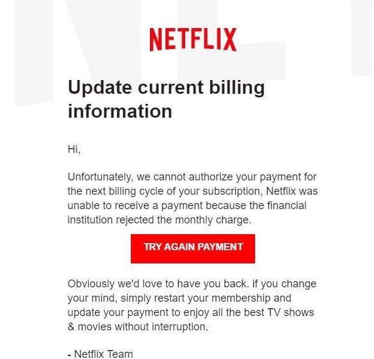
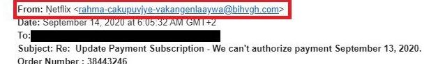
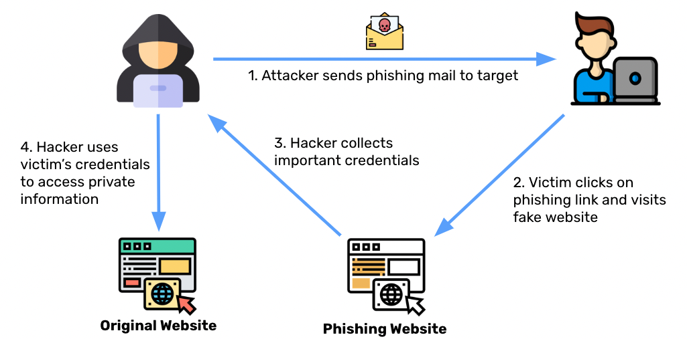
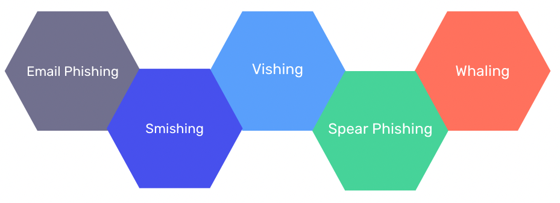

# Phishing

You get the following email that looks like it is from Netflix:

This seems legitimate and you don't want your Netflix account to be discontinued, so you should probably click on that link right? Luckily, you take the time to examine the email address and realize that it is coming from a non Netflix origin.

This is a common example of **phishing**. ⭐️ **Phishing is when a target or targets are contacted by someone posing as a legitimate institution to lure individuals into providing sensitive data.** Phishing can take many forms, but the ultimate goal is to gain access to user data.

### What We Will Learn
- Phishing Example
- What Is Phishing
- Types of Phishing
- How to Prevent Phishing

>[Phishing Video](https://www.loom.com/share/c1d3e9a3832341769372ff53795c6c84)

## How Phishing Attacks Work

The image above provides a general overview of how phishing attacks typically operate.
1. The attacker sends a message to a user with the malicious content.
2. The user clicks on the phishing link and visits a fake website
3. The user inputs their credentials and this allows the hacker to collect important credentials.
4. The hacker then uses the victim's credentials to access private information.

## Types of Phishing Attacks

Phishing attacks can utilize many ways in order to gain information from users:
1. **Email Phishing**: Emails from a well known organizations asking you to click on links to update account information
2. **Smishing**: Phishing attacks that utilize SMS text messages
3. **Vishing**: Telephone equivalent of phishing attacks to get personal information
4. **Spear Phishing**: Phishing attacks that are specifically tailored to a particular individual.
5. **Whaling**: Attacks that masquerade as senior individuals at a company

## #checkoutTheDocs 🔍
- **OWASP**: [Phishing in Depth](https://owasp.org/www-chapter-ghana/assets/slides/OWASP_Presentation_FINAL.pdf)

## Knowledge Check ✅

1. What is a phishing attack?
    - **When a target or targets are contacted by someone posing as a legitimate institution to lure individuals into providing sensitive data**
    - A way of guessing a password, or gaining access to something locked, simply by repetitive, trial and error-based guesswork. 
    - An attack focussed on making a resource unavailable for the purpose it was designed due to a malicious actor.
    - An attack that access information stored in a database that is lacking proper security protocols.

2. An attack designs a specific email to an individual with the hopes of gaining access to sensitive information. Which type of phishing would this be classified as?
    - Vishing
    - Whaling
    - Email Phishing
    - **Spear Phishing**

3. Select all of the following that are protections against phishing.
    - **Require multifactor authentication**
    - **Use SSL Certificates**
    - Use CAPTCHA
    - **Require password updates often**