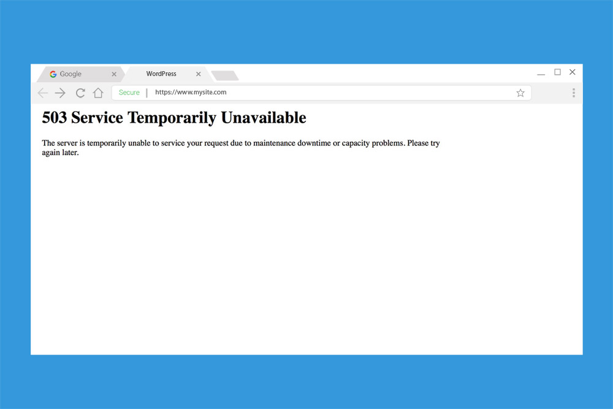
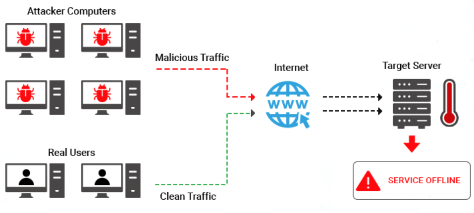

# Distributed Denial of Service (DDoS) Attacks
Suppose you go to your favorite e-commerce site in order to purchase some new shoes. Unfortunately, you get the following message when you try to access their webpage.

It looks like we can't buy our shoes because the site is down! While there is many reasons why a server would respond with a 503 Service Unavailable code, this is often sent because the server is down. One reason a server can be offline is due to a **Distributed Denial of Service (DDoS) Attack**. ⭐️ **DDoS attacks are an attack focussed on making a resource unavailable for the purpose it was designed due to a malicious actor.**

### What We Will Learn
- What is DDoS
- How DDoS Attacks Work
- Protecting Against DDoS Attacks

>[DDoS Attacks Video](https://www.loom.com/share/0884ecf0d08d4c01913968306a3175d5)

## Structure of DDoS Attacks

A DDoS attack usually is the result of a malicious actor controlled many different machines. They may have gained access to these machines through things like malware. Once gaining control of these machines a DDoS attack is executed using the following steps:
1. The computer is the botnet can then be used to request information from the target server. 
2. If proper protections are not in place, the server will not be able to handle this amount of traffic. As a result, the server will either slow or eventually crashes due to this large traffic volume. 
3. This server slowing or being taken offline results in real users not being able to access the information stored on the server.

## #checkoutTheDocs 🔍
- **CISA**: [Understanding Denial of Service Attacks](https://www.cisa.gov/news-events/news/understanding-denial-service-attacks)

## Knowledge Check ✅

1. What is a Distributed Denial of Service Attack?
    - When a target or targets are contacted by someone posing as a legitimate institution to lure individuals into providing sensitive data
    - A way of guessing a password, or gaining access to something locked, simply by repetitive, trial and error-based guesswork. 
    - **An attack focussed on making a resource unavailable for the purpose it was designed due to a malicious actor.**
    - An attack that access information stored in a database that is lacking proper security protocols.

2. How can you protect systems against DDoS attacks?
    - Using multifactor authentication
    - Turning off servers when network traffic is too large
    - **Planning for scale and using cloud computing platforms that autoscale servers when network traffic increases.**
    - Resetting passwords when a DDoS attack starts.