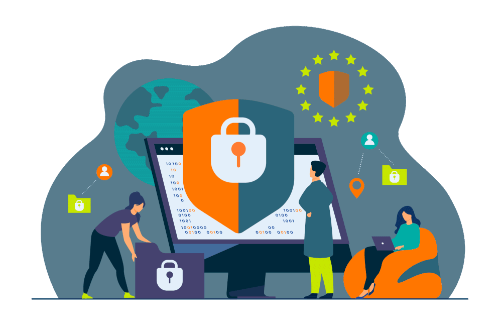

# Cyber Literacy Project Introduction

>[Cyber Literacy Project Introduction Video](https://www.loom.com/share/85f084b2437d4f3e9539b3eaf2caeaa7)

**GOAL**: For the next 3 weeks, you will be doing two projects to demonstrate the knowledge that you learned during this Cyber Literacy Elective.

## Project Part 1: Create an Informational Video

We have learned **A LOT** in the past six week about cyber security and various vulnerabilities outlined in the OWASP Top 10. However, we have not covered the following OWASP Top 10 topics:
- Security Misconfiguration
- Vulnerable and Outdated Components
- Software and Data Integrity Failures
- Security Logging and Monitoring Failures
- Server-Side Request Forgery

**TASK #1**: Create a short (less than 5 minutes) informational video that will educate your peers on **ONE** of the the OWASP Top 10 topics that we haven't yet covered. Your video can be modeled after the ones that we have used in these lessons or you can add your own spin on the topic. The video should, ***at a minimum***, contain:
- An overview of the OWASP Top 10 topic you selected.
- Examples of this security risk in applications.
- How developers can protect against this security risk in their programs.

## Project Part 2: Increase the Security of a Portfolio Project

You have built **A LOT** during your time in this program, but we haven't always considered the security implications of the programs that we are building. You will pick ***ONE*** old project and create a more secure version of the application based on what you have learned these past six weeks.

**TASK #2**: Go back to an old portfolio project and increase the security based on what they have learned in the elective. You can decide what you want to add, but a few ideas are:
1. Adding OAuth or other authentication features
2. Checking user input for malicious content like SQL injection and/or XSS
3. Implementing passwords with correct level of security
4. Fixing routes for proper access controls
5. Researching other security tools and incorporating them in your application.