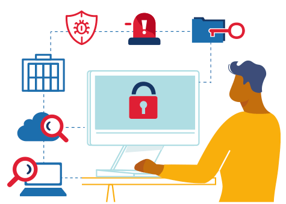

# OWASP Top 10 Topic Selection

We have learned **A LOT** about security risks in web applications. While we have covered a lot from the OWASP Top 10, we have yet to explore the following topics:
- [Security Misconfiguration](https://owasp.org/Top10/A05_2021-Security_Misconfiguration/)
- [Vulnerable and Outdated Components](https://owasp.org/Top10/A06_2021-Vulnerable_and_Outdated_Components/)
- [Software and Data Integrity Failures](https://owasp.org/Top10/A08_2021-Software_and_Data_Integrity_Failures/)
- [Security Logging and Monitoring Failures](https://owasp.org/Top10/A09_2021-Security_Logging_and_Monitoring_Failures/)
- [Server-Side Request Forgery](https://owasp.org/Top10/A10_2021-Server-Side_Request_Forgery_%28SSRF%29/)

**TASK**: Explore the documentation 🔍 above and decide on ONE topic that you want to dig deeper into for your presentation. Submit your topic in the space below.

1. Which of the topics listed above will you be doing your information video on?